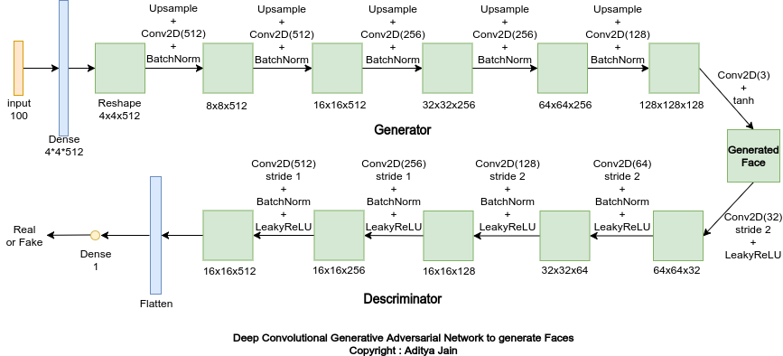

# FaceGAN-Generating-Random-Faces
Generate Random Faces that do not exist. I trained a Deep Convolution GAN (DCGAN) on 100k celebrities photos.


## Getting Started
Here I will explain how to train the FaceGAN, also how to set up the app running in your environment. Also, I will try to explain the basics of the Deep Convolutional Generative Adversarial Network.

### Prerequisites
You will need Python 3.X.X with some packages which you can install directly using requirements.txt.
> pip install -r requirements.txt

### Get the Dataset
I have used the 100k celebrities dataset. You can download that dataset from this location [Link](https://www.kaggle.com/greg115/celebrities-100k).

### Train the model (Get new weights for generator or train further)
Run the train_gan.py file. Using the following flags:
* -w, --weights - saved weights directory
* -p, --photo_dir - directory containing face images
* -b, --batch_size - batch size
* -e, --epochs - number of epochs to run
* -i, --inp_dim - dimension of noise for generator
> python3 train_gan.py --weights ./saved_weights -p ./photos -b 32 -e 10000 -i 100 

### Running the app
Use the following command in the app directory to run the app.
> ``` python3 main.py ```

## DCGAN - Deep Convolutional Generative Adversarial Network
DCGAN is one of the popular and successful network design for GAN. It mainly composes convolution layers without max pooling or fully connected layers. 
<br><br>
They are made of two distinct models, a generator and a discriminator. The job of the generator is to spawn ‘fake’ images that look like the training images. The job of the discriminator is to look at an image and output whether or not it is a real training image or a fake image from the generator. During training, the generator is constantly trying to outsmart the discriminator by generating better and better fakes, while the discriminator is working to become a better detective and correctly classify the real and fake images. The equilibrium of this game is when the generator is generating perfect fakes that look as if they came directly from the training data, and the discriminator is left to always guess at 50% confidence that the generator output is real or fake.

## My Architecuture:



